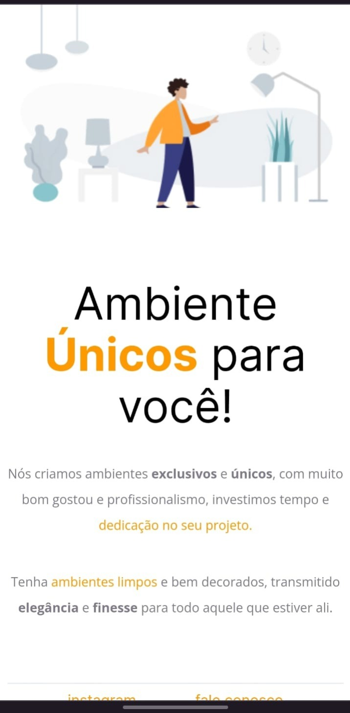

# 🔗Links para acessar o projeto:

<a href="https://moveiscostumizados.netlify.app/"> 📌Link 1: Netlify</a>
 
<a href="https://synxther.github.io/moveis_customizaveis_explorer/"> 📌Link 2: Github</a>
 
<a href="https://moveiscustomizados.vercel.app/"> 📌Link 3: Vencel</a>

# 💻Tecnologia
Este projeto foi desenvolvido em:

  
  

# layout do projeto:

<a href="https://www.figma.com/file/Eg7SEVZZwJ2l1sgSQtVNuR/Explorer---Projeto-01-(Copy)-(Copy)?type=design&node-id=1-2&t=6fPdWtFksBCaZvXt-0">📃 Link do projeto</a>
